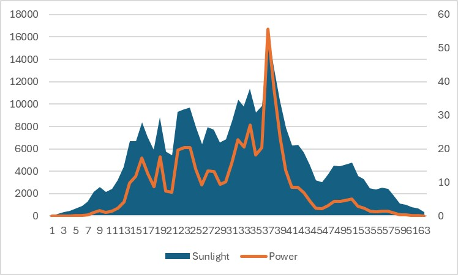
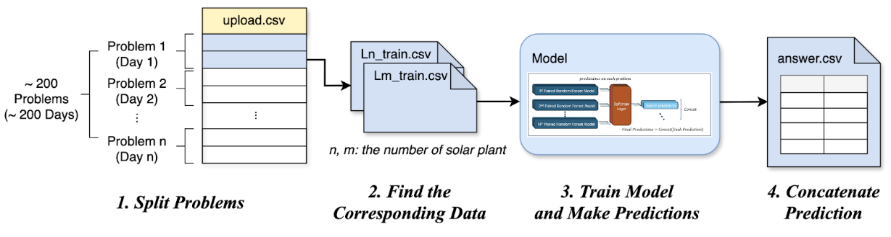
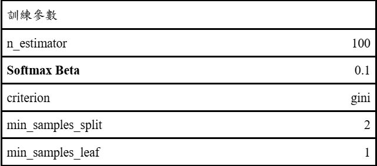

# 根據區域微氣候資料預測發電量競賽 (AI CUP 2024)
## 📚目錄
<details open>
<summary> 目錄 </summary>

> 題目：[根據區域微氣候資料預測發電量競賽](https://tbrain.trendmicro.com.tw/Competitions/Details/36)
> - 📝 [**競賽目標**](#競賽目標)
> - 📦 [**資料格式**](#資料格式)
> - 🧠 [**模型架構**](#模型架構)
> - 💻 [**程式碼**](#程式碼)
</details>


## 隊伍簡介:
<details open>
<summary> 隊伍簡介 </summary>

> ### 隊伍名稱: **Team 6668**
> ### 成員: 
> - 王禮芳 國立成功大學敏求智慧運算學院 (隊長)
> - 莊秉宸 國立成功大學統計學系
> - 李旻昊 國立成功大學敏求智慧運算學院
> - 余振揚 國立成功大學敏求智慧運算學院
>
> ### 最終成績
> - **Public**: 372065.1 **(5th)**
> - **Private**: 386003.4 **(4th)**
</details>

<details open>
<summary> 資料夾目錄 </summary>

> - `BlaBlaBlazzz/` : 主程式所在目錄
> - `image_readme/` : readme 文件的圖片
> - `other_works/` : 過去嘗試的資料整理與其他模型嘗試
</details>


## 📝**競賽目標**
<details open>
<summary> 競賽目標 </summary>

> ### 根據區域微氣候資料預測發電量
> - 透過區域微氣候資料和發電站的歷史資料，預測發電量
</details>


## 📦**資料格式**
<details open>
<summary> 資料格式 </summary>

> **資料集包含以下欄位：**
> - LocationCode : 發電站位置代碼
> - DateTime : 時間
> - WindSpeed(m/s) : 風速
> - Pressure(hpa) : 氣壓
> - Temperature(°C) : 溫度
> - Humidity(%) : 濕度
> - Sunlight(Lux) : 陽光照射強度
>  
> 
> - **Power(mW)** : 發電量(目標值)
</details>

## 📊**資料分析**
<details open>
<summary> 資料分析 </summary>

> ### **資料視覺化**
> 我們發現Sunlight(Lux)和Power(mW)有著高度的正相關。
> 如下圖呈現：
> 
</details>


## 🧠**模型架構**
<details open>
<summary> 模型架構 </summary>

> ## **演算流程**
> 本次競賽我們的演算法分成四段落進行
> 整體流程如下圖呈現：
> 
> #### 1. 分割子問題
> 將目標預測任務以日為單位，切分成兩百個子問題（一天視為一個問題），並建立「目標時間和站點-運轉中發電站」字典。
> #### 2. 尋找對應的訓練資料
> 我們透過篩選目標發電站與預測日期同時運轉的其他發電站，取得其歷史資料的交集。將目標發電站的發電量視為標籤值，並將預測日期同時運轉的其他發電站的相關資料作為特徵，構建模型訓練資料集。
> #### 3. 模型訓練及預測
> 我們為每個目標發電站與目標日期中運轉的發電站建立隨機森林模型，並將預測輸出通過 Softmax 層，根據模型 MAE 分配權重，將預測發電量進行加權聚合。
> #### 4. 對所有子題進行迭代連接
> 以上流程將分別對兩百個子問題逐一進行，並將每個迭代出的預測值進行串接，生成最終的輸出檔案。
>
> ---
> ## **模型架構**
> 模型架構如下圖呈現：
> 123
> #### 1. 成對的隨機森林模型
> 我們以目標發電站的發電量為標籤，利用同時也在運轉的另一發電站其他特徵進行訓練，建置出一由兩成對的發電站資料訓練而成的隨機森林模型。
> #### 2. Softmax Layer
> 在合併各隨機森林模型時，我們引入 softmax layer 為各模型預測值加上權重，一模型的 MAE 愈小，將給其愈大的權重值。換句話說，我們期待能由此提升誤差較小的模型之影響力，同時亦想保留由其他發電站特徵訓練出的模型所挾帶的資訊。
</details>

## 📈 **超參數分析**
<details open>
<summary> 超參數分析 </summary>

> ### **Softmax Layer**
> 在聚合預測值的 Softmax 層中（公式如下）:
> 
> 
> 
> 我們使用 Beta 值來調整模型間的權重影響力
> 
> 簡單來說較大的 Beta 值會使 **MAE 較小的模型有更大的權重，而 MAE 較大的模型效果會被稀釋。**
> ### **Softmax Beta 值分析**
> 
> 我們對 Beta 值對模型表現的影響分析（如下圖）
> 
> 
> 發現 beta 約在 0.12~0.13 時能使模型有更優秀的表現，這是因為此時的權重分配適度強化了 MAE 較低的模型，而未過度削弱 MAE 較高的模型。
> 
>
>## 💡 **最終參數選擇**
> 我們最終選擇了以下參數作為最終模型的超參數：
> 
</details>


## 💻**程式碼**
<details open>
<summary> 程式碼 </summary>

> ### 環境要求：
> - 作業系統：Ubuntu 18.04.6LTS
> - 程式語言：Python 3.9+
> 
> ### 環境安裝：
> ```bash
> pip install -r requirements.txt
> ```
> ### 程式碼運作：
> ```bash
> cd BlaBlaBlazzz 
> python run.py
> ```
</details>


## 🚀 **外部資源與參考文獻**
> 本隊伍於此次比賽期間，撰寫程式時，部分經由 ChatGPT 協助除錯。
- [交通部中央氣象署. (n.d.). 資料瀏覽. CODIS氣候觀測資料查詢服務](https://codis.cwa.gov.tw/StationData)
- [交通部中央氣象署. (n.d.). 臺灣四季太陽仰角與方位角.](https://www.cwa.gov.tw/Data/astronomy/season.pdf)