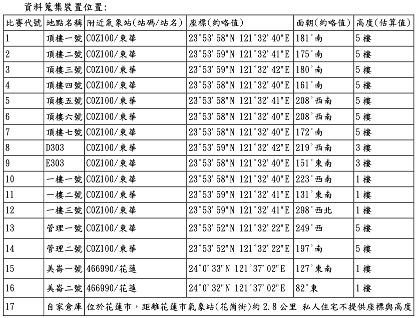

# README
這裡是 AI CUP 2024 (team 6668) 的 repo 

* 競賽網址：https://tbrain.trendmicro.com.tw/Competitions/Details/36

* 獎項包括「學生組排名獎」13名、「趨勢科技人工智慧創意獎」4名（目標是前 13？）

## 🛠️ Usage
大家可以建立自己的資料夾放自己的模型

並且在 server 上 clone

## ⏱️ 時程
* 11/18 test set 釋出
    可以開始上傳資料，每個隊伍一天五筆上傳上限
* 11/28 比賽截止

## 📦 Dataset

可以直接引用已載好或是旻昊學長的資料集（不用再額外下載）
* `36_TraingingData`
* `MH_LI/data/36_TraingingData_Additional_V2`
* `MH_LI/data/36_TestSet_SubmissionTemplate`

### 36_TrainingData
訓練資料集，共有 17 份

* 每個檔案是一個發電站位置
* 包含大約 2000 天的數據
* 發電站地理資訊：（座標/面朝方向/高度）
    

#### Features
* LocationCode
* DateTime
* WindSpeed(m/s)
* Pressure(hpa)
* Temperature(°C)
* Humidity(%)
* Sunlight(Lux)

### 36_TrainingData_Additional_V2

### 36_TestSet_SubmissionTemplate
